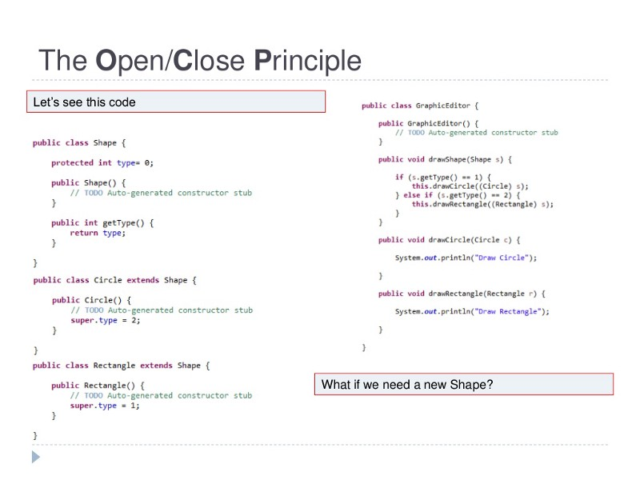
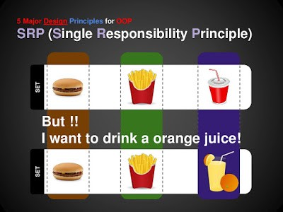
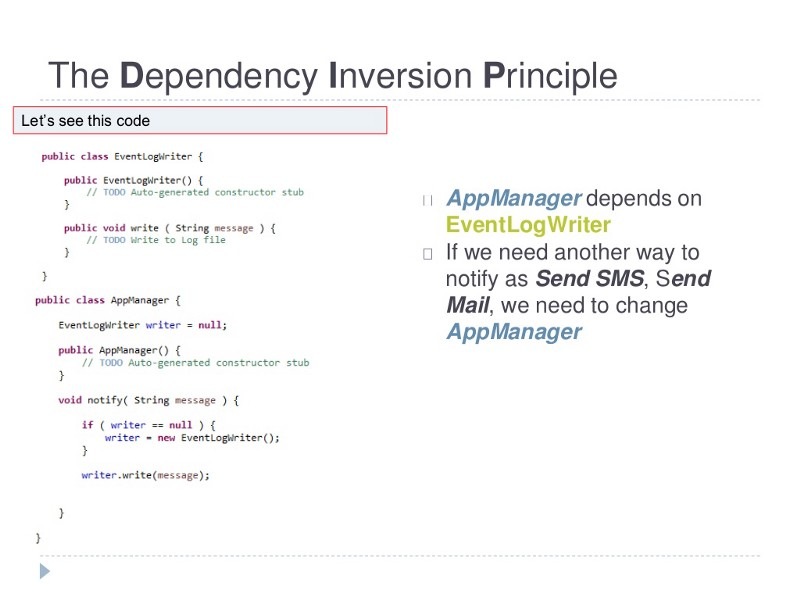
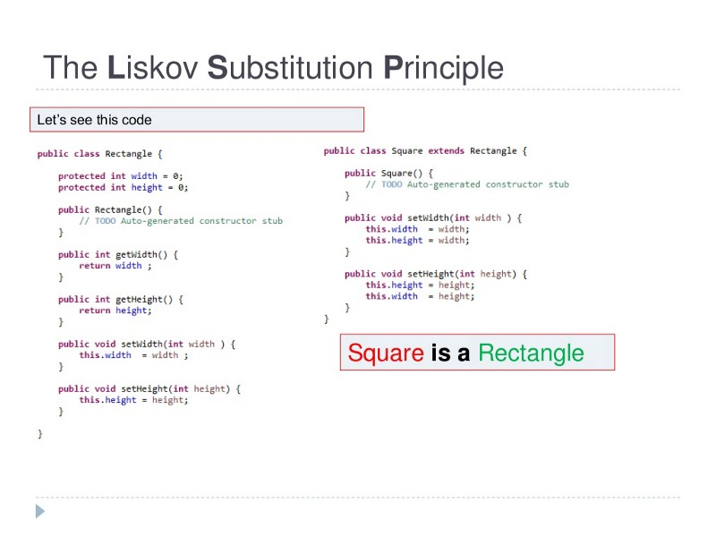
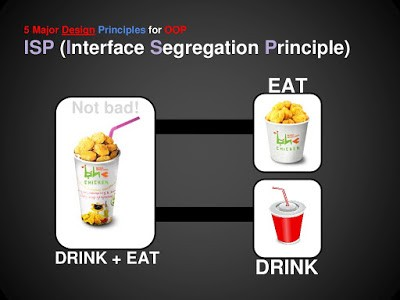
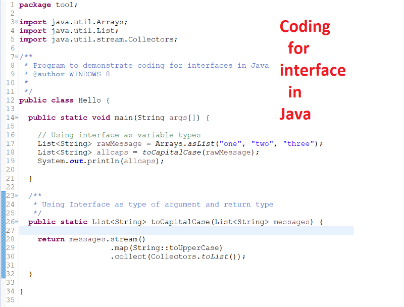
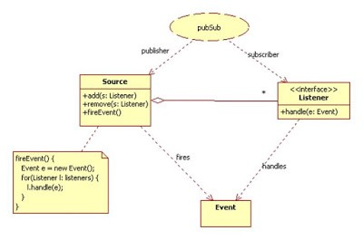
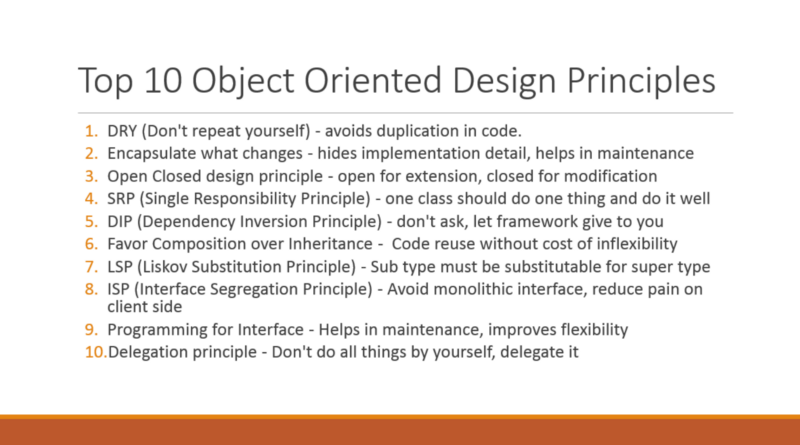

# OOP-Design-Principles-For-Programmers
The __Object-Oriented Design Principles__ are the core of OOP programming, but I have seen most of the Java programmers chasing design patterns like <ins>Singleton pattern</ins>, <ins>Decorator pattern</ins>, or <ins>Observer pattern</ins>, and not putting enough attention on learning Object-oriented analysis and design.  It’s important to learn the basics of Object-oriented programming like Abstraction, Encapsulation, Polymorphism, and Inheritance. But, at the same time, it’s equally important to know object-oriented design principles.

## 1. DRY (Don’t repeat yourself)
Our first object-oriented design principle is DRY, as the name suggests __DRY (don’t repeat yourself)__ means don’t write duplicate code, instead use <ins>Abstraction</ins> to abstract common things in one place.

If you have a block of code in more than two places consider making it a separate method, or if you use a hard-coded value more than one time make them <ins>public final constant</ins>. The benefit of this Object oriented design principle is in __maintenance__.

> It’s important not to abuse it, duplication is not for code, but for functionality.

It’s important not to abuse it, duplication is not for code, but for functionality.
It means if you have used common code to validate OrderId and SSN it doesn’t mean they are the same or they will remain the same in future.
<p align="center">

<p>
By using common code for two different functionality or thing you closely couple them forever and when your OrderId changes its format, your SSN validation code will break.
 
So beware of such coupling and just don’t combine anything which uses the similar code but are not related. You can further check out the __Basics of Software Architecture & Design Patterns__ in Java course on Udemy to learn more about writing good code and best practices to follow while designing a system.

## 2. Encapsulate What Changes
There is only one thing which is constant in the software field and that is “Change”, So, encapsulate the code you expect or suspect to be changed in future.

> The benefit of this OOP Design principle is that It’s easy to test and maintain proper encapsulated code.

The benefit of this OOP Design principle is that It’s easy to test and maintain proper encapsulated code.
If you are coding in Java then follow the principle of <ins>making variable and methods private</ins> by default and increasing access step by step like from a private to <ins>protected</ins> and not <ins>public</ins>.


Several of the design patterns in Java uses Encapsulation, the <ins>Factory design pattern</ins> is one example of Encapsulation which encapsulates object creation code and provides flexibility to introduce a new product later with no impact on existing code.
 
Btw, if you are interested in learning more about design patterns in Java and Object Oriented Programming then you must check this __Design Pattern Library__ course Pluralsight. It’s one of the best collection of design patterns and advice on how to use them in the real world.

## 3. Open Closed Design Principle
According to tho this OOP design principle, “Classes, methods or functions should be Open for extension (new functionality) and Closed for modification”.

This is another beautiful SOLID design principle, coined by Uncle Bob on his classic __<ins>Clean Code</ins>___ book, which prevents someone from changing already tried and tested code.

> The key benefit of this design principle is that already tried and tested code is not touched which means they won’t break.

The key benefit of this design principle is that already tried and tested code is not touched which means they won’t break.
Here is a Java code example which violates the Open Closed Design Principle of Programming:




In this code GraphicEditor is tightly coupled with Shape, If you need a new Shape then you need to modify already tried and tested code inside the ```drawShape(Shape s)``` method, which is both error-prone and not desirable.

Ideally, if you are adding new functionality only than your code should be tested and that’s the goal of <ins>Open Closed Design principle</ins>.

By the way, the Open-Closed principle is “O” from the SOLID acronym. If you want to learn more about this principle, the __<ins>SOLID Principles of Object-Oriented Design and Architecture</ins>__ course on Udemy is one of the best resources to consult.

## 4. Single Responsibility Principle (SRP)
Single Responsibility Principle is another SOLID design principle, and represent “S” on the SOLID acronym. As per SRP, there should not be more than one reason for a class to change, or a class should always handle single functionality.

> The key benefit of this principle is that it reduces __coupling__ between the individual component of the software and Code.

The key benefit of this principle is that it reduces coupling between the individual component of the software and Code.
For example, If you put more than one functionality in one Class in Java it introduces coupling between two functionality and even if you change one functionality there is a chance you broke coupled functionality, which requires another round of testing to avoid any surprise on the production environment.
 
You can further see __<ins>From 0 to 1: Design Patterns — 24 That Matter</ins>__ course on Udemy to learn about patterns which are based on this principle.




## 5. Dependency Injection or Inversion principle
Don’t ask for dependency it will be provided to you by the framework. This has been very well implemented in <ins>Spring framework</ins>, one of the most popular Java framework for writing real-worth applications.

> The beauty of this design principle is that any class which is injected by DI framework is easy to test with the mock object and easier to maintain because object creation code is centralized in the framework and client code is not littered with that.

There are multiple ways to implemented __<ins>Dependency injection</ins>__ like using bytecode instrumentation which some AOP (Aspect Oriented programming) framework like AspectJ does or by using proxies just like used in Spring.

You can further see the __<ins>SOLID Principles of Object-Oriented Design and Architecture</ins>__ course on Udemy to learn more about this useful principle. It also represents “D” on the SOLID acronym.

Here is an example of the code which violates Dependency Inversion Principle or DIP in Java:




You can see that ```AppManager``` depends upon ```EventLogWriter``` which is tightly coupled with the ```AppManager```. If you need to use another way to notify your client like by sending push notifications, SMS, or E-mail, you need to change the ```AppManager``` class.

This problem can be solved by using the Dependency Inversion Principle where instead of ```AppManager``` asking for ```EventLogWriter```, it will be injected or provided to AppManager by the framework.

You can further see Using SOLID Principles to Write Better Code — A Crash Course on Udemy to learn more about the Dependency Inversion Principle and how to solve such problems.

## 6. Favor Composition over Inheritance
There are two general ways to reuse the code you have already written, Inheritance and Composition, both have their own advantage and disadvantages, but, in general, you should always favor composition over inheritance, if possible.

> Some of you may argue this, but I found that <ins>Composition</ins> is the lot more flexible than <ins>Inheritance</ins>.

Some of you may argue this, but I found that Composition is the lot more flexible than Inheritance.
Composition allows changing the behavior of a class at run-time by setting property during run-time and by using Interfaces to compose a class we use <ins>polymorphism</ins> which provides flexibility to replace with better implementation any time.

Even Joshua Bloch’s __<ins>Effective Java</ins>__ advise favoring composition over inheritance. If you are still not convinced then you can also read here to learn more about why your Composition is better than Inheritance for reusing code and functionality.

And, if you keep forgetting this rule, here is a nice cartoon to put in your desk :-)


## 7. Liskov Substitution Principle (LSP)
According to the Liskov Substitution Principle, Subtypes must be substitutable for supertype I mean methods or functions which uses superclass type must be able to work with the <ins>object</ins> of subclass without any issue”.
 
LSP is closely related to the ___Single responsibility principle and Interface Segregation Principle__.

> If a class has more functionality than subclass might not support some of the functionality and does violate LSP.

In order to follow <ins>LSP SOLID design principle</ins>, derived class or subclass must enhance functionality, but not reduce them. LSP represents “L” on the SOLID acronym.

Here is a code example which violates the Liskov Substitution Principle in Java:



If you have a method ```area(Rectangle r)``` which calculates the area of Rectangle then that code will break when you pass the ```Square``` because ```Square``` is not really a Rectangle.

## 8. Interface Segregation Principle (ISP)
Interface Segregation Principle stats that, a client should not implement an <ins>interface</ins> if it doesn’t use that.

This happens mostly when one interface contains more than one functionality, and the client only needs one functionality and no other.
 
There is no doubt that Interface design is a tricky job because once you release your interface you can not change it without breaking all implementation. Well, Java 8’s <ins>default or defender</ins> method feature does provide a way for interface evolution but not all Programming language support that features.

> Another benefit of this design principle in Java is, the interface has the disadvantage of implementing all method before any class can use it so having single functionality means less method to implement.

Another benefit of this design principle in Java is, the interface has the disadvantage of implementing all method before any class can use it so having single functionality means less method to implement.




## 9. Programming for Interface not implementation
A programmer should _always program for the interface and not for implementation_ this will lead to flexible code which can work with any new implementation of the interface.
 
In concrete words, you should use interface type on variables, return types of a method or argument type of methods in Java like using ```SuperClass``` type to store object rather using ```SubClass```.

I mean

```List numbers= getNumbers();```

instead of

```ArrayList numbers = getNumbers();```
 
Here is an example of Coding for the interface in Java:




## 10. Delegation principles
Don’t do all stuff by yourself, delegate it to the respective class. Classical example of delegation design principle is <ins>equals() and hashCode() method in Java</ins>.

> In order to compare two objects for equality, we ask the class itself to do comparison instead of Client class doing that check.

In order to compare two objects for equality, we ask the class itself to do comparison instead of Client class doing that check.
The key benefit of this design principle is __no duplication of code__ and pretty easy to modify behavior. Event delegation is another example of this principle, where an event is delegated to handlers for handling.




## Summary
All these __object-oriented design principles__ help you write flexible and better code by striving high cohesion and low coupling.

The theory is the first step, but what is most important is to develop the ability to find out when to apply these design principles.


 
Once you get hold of that, the next step is to learn Design patterns in Java, which uses these design patterns to solve common problems of application development and software engineering.

